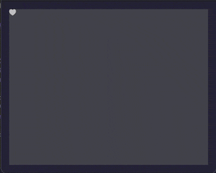
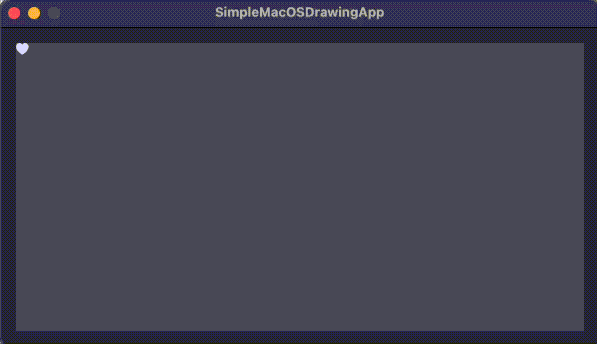
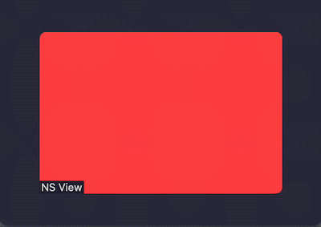
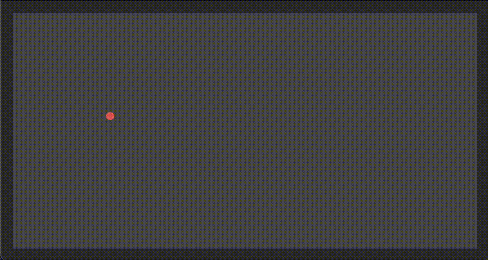
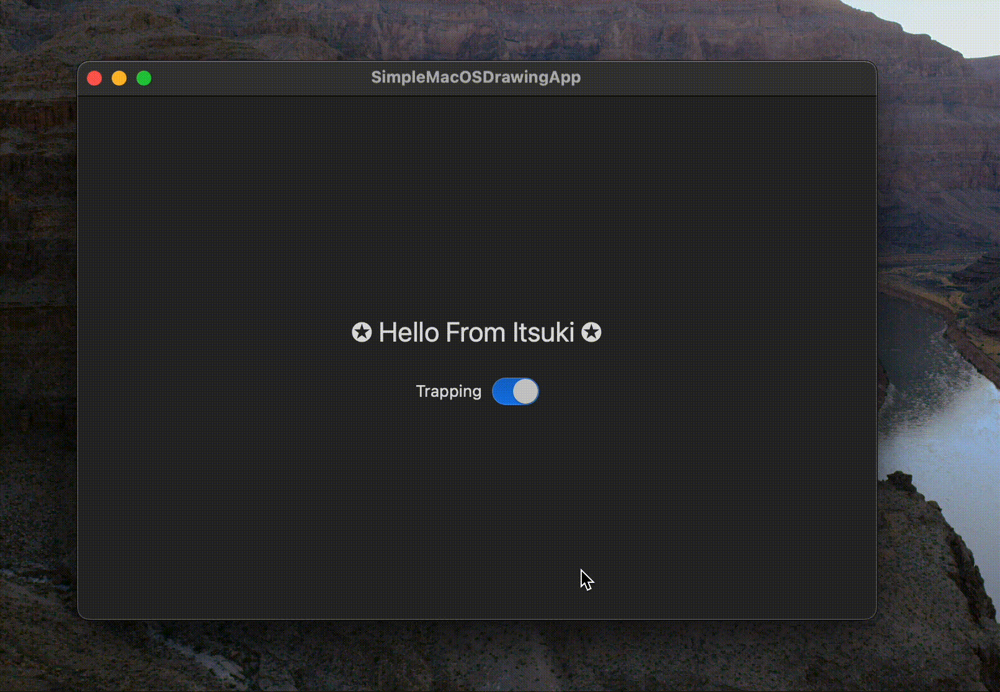

# Demo for Handling Mouse and Trackpad Events (SwiftUI)

## Mouse Down, Up and Pressure Change

A simple [Drawing View](./SimpleMacOSDrawingApp/MousePressureDemo.swift) for demoing on how to
handle [mouseDown(with:)](https://developer.apple.com/documentation/appkit/nsresponder/mousedown(with:)), [mouseUp(with:)](https://developer.apple.com/documentation/appkit/nsresponder/mouseup(with:)), and [pressureChange(with:)](https://developer.apple.com/documentation/appkit/nsresponder/pressurechange(with:)) events.



### Additional Notes & Discussion

Pure SwiftUI way for getting notified on Mouse Events can be done by using [addLocalMonitorForEvents(matching:handler:)](https://developer.apple.com/documentation/appkit/nsevent/addlocalmonitorforevents(matching:handler:)).<br>
```swift
.onAppear(perform: {
    NSEvent.addLocalMonitorForEvents(matching: [.leftMouseDown, .leftMouseUp, .pressure]) { event in
        print(event)
        return event
    }
})
```

However, there does not exist a built-in way for converting `CGPoint` in the window to the local view coordinate.<br>
Using `GeometryReaderProxy` like following to convert coordinates will result in a tiny shift in the y-coordinate as shown in the gif below (that may due to the window bar height?).


```swift
extension GeometryProxy {
    func convert(_ point: CGPoint, from coordinateSpace: CoordinateSpace) -> CGPoint {
        let frame = self.frame(in: coordinateSpace)
        let localViewPoint = CGPoint(x: point.x-frame.origin.x, y: point.y-frame.origin.y)
        return localViewPoint
    }
}
```




For more details, please refer to [SwiftUI/MacOS: Handle Mouse/Trackpad Events (Mouse Up, Mouse Down, Pressure Change)](https://medium.com/@itsuki.enjoy/swiftui-macos-handle-mouse-trackpad-events-mouse-up-mouse-down-pressure-change-f3ff9755be0e)


## Mouse Enter and Exit

[Tracking View](./SimpleMacOSDrawingApp/NSTrackingViewDemo.swift) for demoing on how to track Mouse Enter and exit events with `NSTrackingView`.



For more details, please refer to [SwiftUI/MacOS: NSTrackingView For Mouse Enter and Mouse Exit)]()


## Map Finger Position on TrackPad to View

Map finger position on trackpad to SwiftUI View using `NSEvents`: 
1. [touchesBegan(with:)](https://developer.apple.com/documentation/appkit/nsresponder/touchesbegan(with:)
2. [touchesMoved(with:)](https://developer.apple.com/documentation/appkit/nsresponder/touchesmoved(with:))





### Note and Considerations

Pure SwiftUI approach using [addLocalMonitorForEvents(matching:handler:)](https://developer.apple.com/documentation/appkit/nsevent/addlocalmonitorforevents(matching:handler:))

```swift
struct TrackpadMappingPureSwiftUI: View {
    @State private var normalizedPoints: [CGPoint] = []
    
    var body: some View {
        GeometryReader { proxy in
            ForEach(0..<normalizedPoints.count, id: \.self) { index in
                let touchPoint = normalizedPoints[index]
                Circle()
                    .foregroundColor(Color.red)
                    .frame(width: 10, height: 10)
                    .position(CGPoint(x: proxy.size.width * touchPoint.x, y: proxy.size.height * (1-touchPoint.y)))
            }

        }
        .padding()
        .onAppear(perform: {
            NSEvent.addLocalMonitorForEvents(matching: [.gesture]) { event in
                handleTouches(with: event)
                return event
            }
        })

        .frame(width: 600, height: 320)
        .fixedSize()
    }
    
    private func handleTouches(with event: NSEvent) {
        let touches = event.touches(matching: .touching, in: nil)
        self.normalizedPoints = touches.map({$0.normalizedPosition})
    }
    
}

```
#### Potential Problems with the Pure SwiftUI approach

1. We don't have an `EventTypeMask` specialized indirect touches. For direct ones, there exists an directTouch. However, for indirect ones, the generic gesture seems to be the only option we have.I haven not recognize much a difference between the events reported by the generic event monitor and Touch Events on NSView but I am afraid that there exists some edge cases.
2. when we retrieve touches for the event, we don't have an NSView we can pass into the `NSEvent.touches(for:)`. We are using a similar method `touches(matching:in:)` above, but still, since we don't have an NSView , we are using nil for the second view parameter. Which means we will end up getting all touches regardless of their targeted view.

For more details, please refer to [SwiftUI/MacOS: Map Finger Position on Trackpad to View)]()


## Mouse/Cursor Trapping

A simple [Trapping View](./SimpleMacOSDrawingApp/MouseTrappingDemo.swift) for demoing on how trap mouse position within the window.



For more details, please refer to [SwiftUI/MacOS: Trap Mouse Cursor in Window)](https://medium.com/@itsuki.enjoy/swiftui-macos-trap-mouse-cursor-in-window-41e08e3a8c12)

